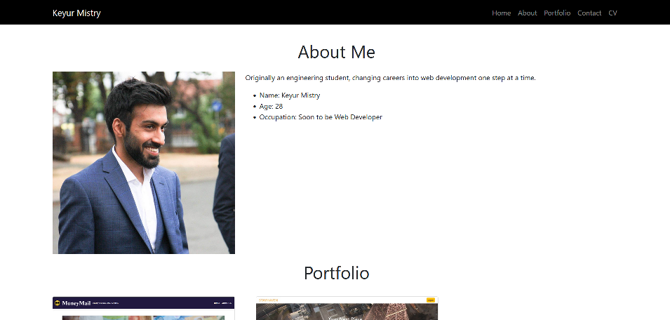

# Updated-portfolio

## Table of Contents

- [Description](#description)
- [Installation](#installation)
- [Initialisaton](#initialisation)
- [Media](#media)
- [License](#license)
- [Contributing](#contributing)
- [Tests](#tests)
- [Questions](#questions)

## Description

A simple portfolio using HTML and CSS.

## Installation

Please follow the instructions on how to install the application:

```
none
```

## Initialisation

Please follow the instructions below to run the application:

```
none
```

## Media

Below is a screenshot of the portfolio:


## License

This Project is licensed under MIT 

## Contributing

Ways to contribute to the project include:

none

## Tests

Follow the instructions below:

none

## Questions

You can e-mail me at: keyurmist@gmail.com

Visit my GitHub 
